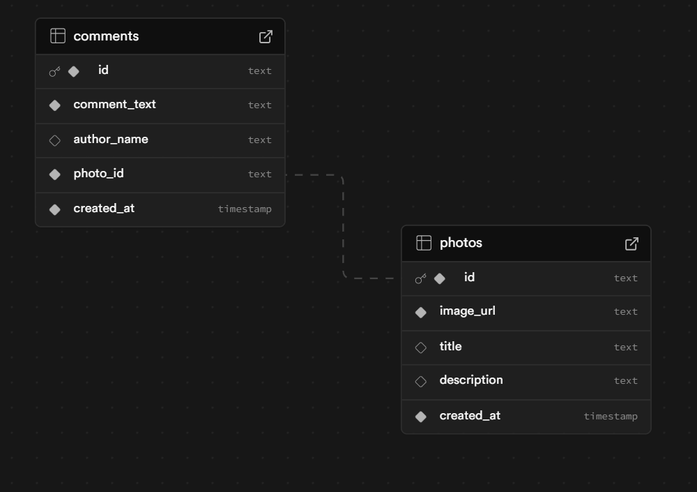

# 📸 Gallery Post — Full-Stack Photo Sharing App

A full-stack gallery application that allows users to upload photos, browse the gallery, and leave comments.  
Designed to be clean, responsive, and fully deployed with a real database.

---

## 🚀 Tech Stack

### Frontend
- **Next.js (App Router)** + TypeScript
- **Ant Design** UI components
- **TailwindCSS** configuration
- Axios for API communication
- Fully responsive layout

### Backend
- **Node.js + Express (TypeScript / ES Modules)**
- **Prisma ORM "V.7" (Latest Version)**
- **PostgreSQL** + Supabase Storage Service
- Swagger API documentation

---

## 🌟 Core Features

| Feature | Description |
|--------|-------------|
| 🖼️ Upload Photos | Drag & Drop with preview before upload |
| 💬 Comment System | Comment on individual photos |
| 🧩 Gallery Grid | Masonry-like layout showing all posts |
| 🔄 Auto Refresh | New uploads auto-appear in gallery |
| 🌚 Dark Mode | Theme persistence via localStorage |
| 🔗 Share & Embed | Copy embed snippet for external usage |
| ⬇️ Download | Save image directly to local device |

---

## 🧭 Demo

- 🌍 Frontend (Vercel): **https://gallery-post.vercel.app/**
- 📡 Backend / Swagger Docs: **https://gallery-post.onrender.com/api-docs/**

> *Both services deployed and running in production.*

---

## 📸 Database Design

### 🏛️ Tables Overview

#### 📷 `photos`
| Column | Type | Attributes | Description |
|--------|------|------------|-------------|
| `id` | UUID | PK | Unique identifier for each photo |
| `image_url` | TEXT | Required | Public image URL |
| `title` | TEXT | Optional | Title shown in gallery |
| `description` | TEXT | Optional | User-provided description |
| `created_at` | TIMESTAMP | Default: now() | Upload timestamp |

---

#### 💬 `comments`
| Column | Type | Attributes | Description |
|--------|------|------------|-------------|
| `id` | UUID | PK | Unique identifier for each comment |
| `comment_text` | TEXT | Required | Comment message |
| `author_name` | TEXT | Optional | Defaults to “Anonymous” if empty |
| `photo_id` | UUID | FK → `photos.id` | Links comment to a photo |
| `created_at` | TIMESTAMP | Default: now() | Comment timestamp |

---

### 🔗 Relationships

| Relationship | Rule |
|-------------|------|
| One Photo → Many Comments | A post can have multiple feedback entries |
| Cascade Delete | Deleting a photo removes all linked comments |

This ensures:
- No orphaned comments
- Easy querying for photo detail pages

---

## 📌 API Endpoints

| Method | Endpoint | Description |
|--------|----------|-------------|
| GET | `/photos` | Get all photos |
| POST | `/photos` | Upload a new photo |
| GET | `/photos/:id` | Get photo details with comments count |
| GET | `/comments/:photoId` | Fetch comments for a specific photo |
| POST | `/comments` | Add a comment |

Swagger UI is available at:  
➡️ `/api-docs`

---

## 🧩 Improvements & Future Enhancements

User authentication, Views count User

Add Like Reaction on Photo

Pagination / infinite scroll for gallery

Sort with New Latest Post & Popular

Image optimization + CDN delivery

Better caching

**DEFINITELY MORE FEATURES**

### Author: **Tran Chan Hung**  
📧 ninbook0708@gmail.com | 🌐 [github.com/hunggoodkidz](https://github.com/hunggoodkidz)
